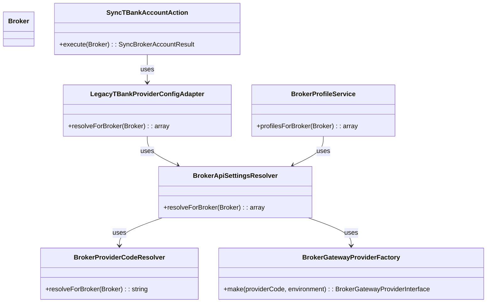
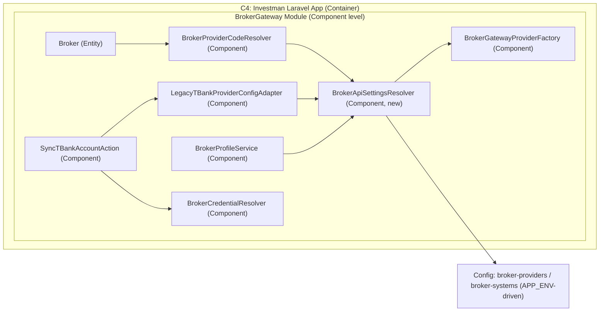

# План: Резолв API-настроек по записи брокера (provider_code + APP_ENV)

Дата: 2026-06-08  
Режим: full  
Текущая ветка: `develop` (создание новой ветки отключено в `git.create_branches=false`)

## Settings

- Testing: `yes`
- Logging: `minimal` (только WARN/ERROR для runtime-потока)
- Docs: `yes` (обязательный docs-checkpoint после реализации)

## Roadmap Linkage

- Milestone: `Резолв API-настроек по выбранному ключу`
- Rationale: устранить текущий разрыв между сохраненным `provider_code` в `brokers` и runtime-конфигом TBank, чтобы путь синка и профилей резолвил API-настройки из записи брокера без хардкода провайдера.

## Scope и границы

- Включено:
  - единый runtime-резолв API-настроек по `Broker` через `provider_code`;
  - использование текущего `APP_ENV`-контракта для `environment` (`prod/sandbox`) без новых полей БД;
  - устранение хардкода `'tbank'` в adapter/sync пути;
  - регрессионные unit/feature тесты и docs-обновление;
  - фиксация class diagram в плане и ее перенос в документацию после реализации.
- Не включено:
  - добавление `connection_key`/`environment` в таблицу `brokers`;
  - изменения MoonShine UI и новых select полей;
  - расширение на новых провайдеров (`alfa`, `sber`) beyond текущий `tbank` контур;
  - переработка credential-модели в multi-environment формат.

## Class Diagram (planned)

## C4 Diagram (planned, Component level)

## Tasks

### Фаза 1 - Дизайн runtime-резолвера

### [x] Task 1: Ввести единый резолвер API-настроек для Broker
- Deliverable: отдельный сервис резолва возвращает согласованные runtime-параметры (`provider_code`, `environment`, `base_url`, `timeout`, `app_name`) для заданного `Broker`.
- Файлы: `laravel_app/app/Modules/BrokerGateway/Core/BrokerApiSettingsResolver.php` (new).
- Что сделать:
  - реализовать цепочку `BrokerProviderCodeResolver -> BrokerGatewayProviderFactory->make(provider_code)` с текущим fallback на `APP_ENV`;
  - вернуть структуру параметров в стабильном формате для потребителей;
  - бросать предсказуемое исключение при невалидном provider-конфиге.
- Logging requirements:
  - не добавлять DEBUG/INFO в успешном потоке;
  - ошибки резолва отдавать через исключения и существующий WARN/ERROR контур вызывающих слоев.
- Dependency notes: базовая задача, блокирует Task 2-5.

### [x] Task 2: Зарегистрировать резолвер в DI-контейнере
- Deliverable: `BrokerApiSettingsResolver` доступен через контейнер в app и module слоях.
- Файлы: `laravel_app/app/Providers/BrokerGatewayServiceProvider.php`.
- Что сделать:
  - добавить singleton/binding резолвера и зависимостей;
  - проверить отсутствие циклических зависимостей.
- Logging requirements:
  - runtime-логи не добавлять;
  - ошибки конфигурации контейнера выявлять тестами/исключениями.
- Dependency notes: зависит от Task 1.

### Фаза 2 - Подключение runtime consumers

### [x] Task 3: Убрать хардкод провайдера в LegacyTBankProviderConfigAdapter
- Deliverable: adapter резолвит конфиг через `BrokerApiSettingsResolver`, а не через `make('tbank')`.
- Файлы: `laravel_app/app/Modules/BrokerGateway/Providers/TBank/Infrastructure/Adapters/LegacyTBankProviderConfigAdapter.php`.
- Что сделать:
  - заменить текущий `resolve()` на broker-aware вариант с входным `Broker`;
  - явно определить стратегию совместимости сигнатуры (bridge/fallback метод при необходимости), чтобы не сломать существующих callers в переходном периоде;
  - использовать данные резолвера для `base_url`, `timeout`, `environment`, `app_name`;
  - сохранить обратную совместимость контракта результата для текущих callers.
- Logging requirements:
  - не добавлять новые INFO/DEBUG;
  - в случае ошибок использовать существующий error flow вызывающего слоя.
- Dependency notes: зависит от Task 1-2.

### [x] Task 4: Подключить broker-aware adapter в SyncTBankAccountAction
- Deliverable: синк TBank получает runtime-настройки по записи брокера, а не по глобальному хардкоду.
- Файлы: `laravel_app/app/Modules/BrokerGateway/Providers/TBank/Application/SyncTBankAccountAction.php`.
- Что сделать:
  - передавать `Broker` в adapter;
  - убедиться, что credential-resolver и HTTP client продолжают работать по прежнему контракту.
- Logging requirements:
  - придерживаться текущего минимального логирования (WARN/ERROR в исключительных кейсах);
  - не добавлять лишние успешные INFO.
- Dependency notes: зависит от Task 3.

### [x] Task 5: Унифицировать BrokerProfileService через новый резолвер
- Deliverable: сервис профилей использует ту же runtime-цепочку резолва, что и sync path.
- Файлы: `laravel_app/app/Services/BrokerGateway/Profiles/BrokerProfileService.php`.
- Что сделать:
  - заменить дублирующий резолв конфигурации на `BrokerApiSettingsResolver`;
  - сохранить формат `BrokerProfileData` и текущий контракт API ресурса.
- Logging requirements:
  - без новых DEBUG/INFO;
  - ошибки оставлять в текущем WARN/ERROR контуре сервиса.
- Dependency notes: зависит от Task 1-2.

### Фаза 3 - Тестовый контракт

### [x] Task 6: Добавить unit-тесты нового резолвера
- Deliverable: unit-покрытие подтверждает корректный резолв параметров и ошибки конфиг-контракта.
- Файлы: `laravel_app/tests/Unit/BrokerGateway/Core/BrokerApiSettingsResolverTest.php` (new).
- Что сделать:
  - кейс успешного резолва по `provider_code` из Broker;
  - кейс fallback провайдера при пустом значении (по текущему resolver-контракту);
  - кейс fallback `environment` на `'sandbox'` при пустом/невалидном `default_environment` в provider/global config;
  - негативный кейс на невалидную конфигурацию/unsupported provider.
- Logging requirements:
  - логи в тестах не добавлять;
  - assertion messages делать диагностичными по контракту резолва.
- Dependency notes: зависит от Task 1-2.

### [x] Task 7: Добавить unit-тесты LegacyTBankProviderConfigAdapter
- Deliverable: unit-покрытие adapter-контракта подтверждает broker-aware резолв и стабильный формат результата.
- Файлы: `laravel_app/tests/Unit/BrokerGateway/Providers/TBank/Infrastructure/Adapters/LegacyTBankProviderConfigAdapterTest.php` (new).
- Что сделать:
  - покрыть позитивный кейс `resolveForBroker(Broker)` с корректным provider/runtime config;
  - проверить контракт результата (`environment`, `base_url`, `timeout`, `app_name`);
  - добавить негативный кейс на невалидный provider/runtime-конфиг.
- Logging requirements:
  - логи в тестах не добавлять;
  - assertion messages должны явно указывать нарушенный adapter-контракт.
- Dependency notes: зависит от Task 3.

### [x] Task 8: Добавить тесты APP_ENV→environment контракта для нового резолвера
- Deliverable: тесты подтверждают, что новый runtime-резолвер сохраняет текущий контракт окружений (`production -> prod`, non-production -> sandbox).
- Файлы: `laravel_app/tests/Unit/BrokerGateway/Core/BrokerApiSettingsResolverTest.php`.
- Что сделать:
  - добавить сценарий загрузки резолва при `APP_ENV=production`;
  - добавить сценарий загрузки резолва при non-production env;
  - проверить, что вычисленный `environment` и `base_url` соответствуют текущим config expectations.
- Logging requirements:
  - логи в тестах не добавлять;
  - использовать диагностичные assert-сообщения по env-контракту.
- Dependency notes: зависит от Task 1-2.

### [x] Task 9: Обновить feature-тесты sync runtime пути
- Deliverable: feature-тесты подтверждают, что sync runtime больше не зависит от хардкода `'tbank'`.
- Файлы: `laravel_app/tests/Feature/Broker/SyncTBankAccountActionTest.php`, при необходимости `laravel_app/tests/Feature/Broker/SyncBrokerAccountActionTest.php`.
- Что сделать:
  - добавить сценарий выбора runtime-настроек через persisted `provider_code`;
  - проверить, что URL/timeout берутся из провайдер-конфига через новую цепочку;
  - добавить негативный кейс на невалидный `provider_code` в runtime.
- Logging requirements:
  - не добавлять runtime-логи внутри тестов;
  - диагностировать контракты через assertion messages.
- Dependency notes: зависит от Task 3-8.

### [x] Task 10: Добавить тесты BrokerProfileService после унификации резолва
- Deliverable: покрытие подтверждает, что `BrokerProfileService` использует тот же broker-aware runtime-контур, что и sync path.
- Файлы: `laravel_app/tests/Feature/Broker/BrokerProfileServiceTest.php` (new) или `laravel_app/tests/Unit/Services/BrokerGateway/Profiles/BrokerProfileServiceTest.php` (new, по выбранному паттерну проекта).
- Что сделать:
  - покрыть успешный кейс профилей через новый резолвер (`provider_code -> runtime config`);
  - покрыть error/fallback кейс с предсказуемым сообщением для ресурса;
  - проверить сохранение контракта ответа (`provider`, `environment`, `account_*`/`error` поля).
- Logging requirements:
  - логи в тестах не добавлять;
  - использовать диагностичные assert-сообщения для profile runtime контракта.
- Dependency notes: зависит от Task 5 и Task 7.

### Фаза 4 - Документация и верификация

### [x] Task 11: Обновить docs и прогнать целевые проверки качества
- Deliverable: docs отражают новый runtime-контур, целевые тесты зеленые.
- Файлы: `docs/configuration.md`, `docs/architecture.md`, при необходимости `docs/README.md`.
- Что сделать:
  - документировать цепочку резолва `broker.provider_code -> resolver -> factory -> connection_keys`;
  - зафиксировать, что `environment` остается derived from `APP_ENV`, не хранится в `brokers`;
  - перенести и актуализировать class diagram из этого плана в документацию (`docs/architecture.md` или профильный раздел);
  - перенести и актуализировать C4 component-диаграмму из этого плана в документацию;
  - сверить диаграмму с фактическими сигнатурами реализованных классов/методов после кода и обновить при расхождениях;
  - выполнить целевой тестовый прогон по измененным unit/feature тестам.
- Logging requirements:
  - в коде новые runtime-логи не добавлять;
  - в документации явно указать минимальный policy (WARN/ERROR) для runtime-ошибок.
- Dependency notes: зависит от Task 6-10.

## Commit Plan

- Commit 1 (после Task 1-2): `feat(broker-gateway): add broker api settings resolver`
- Commit 2 (после Task 3-5): `refactor(tbank): resolve runtime config from broker context`
- Commit 3 (после Task 6-11): `test(docs): cover broker-aware config resolve and update docs`
