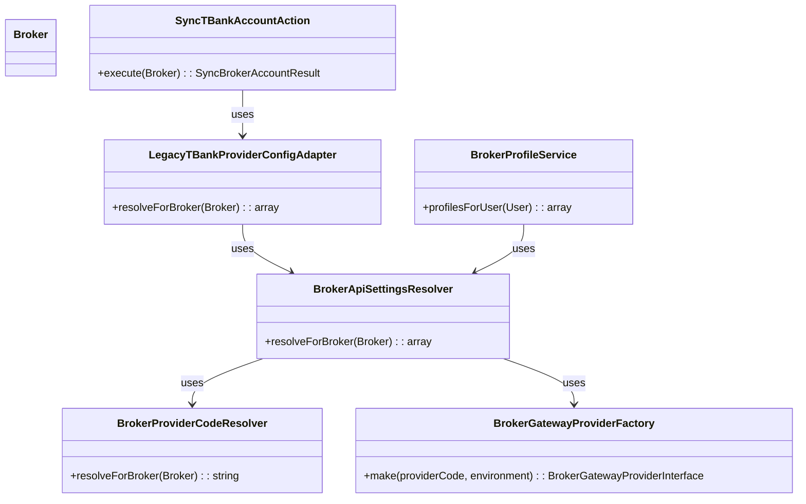
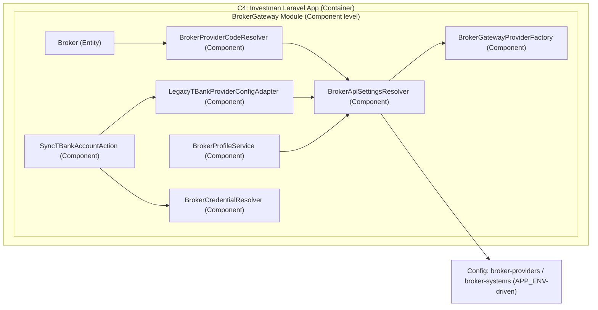
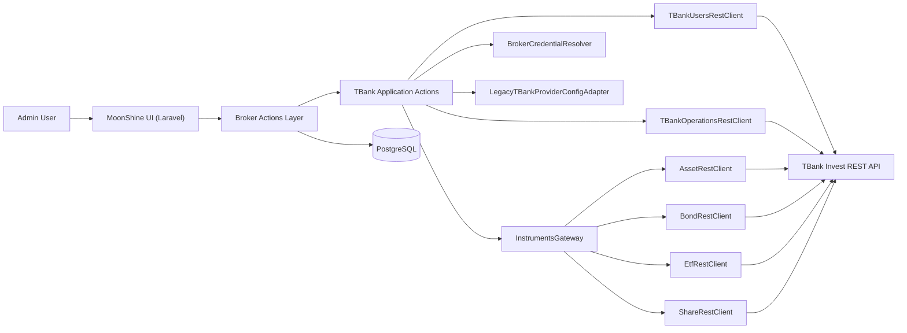
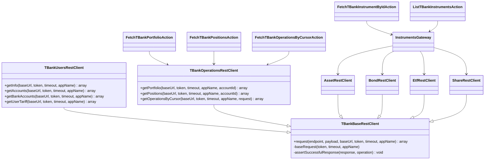

[Back to README](../README.md) · [Configuration →](configuration.md)

# Architecture

Проект построен как модульный монолит на Laravel 12 с явным разделением доменной логики, UI-слоя и инфраструктуры.

## Основные границы

- `laravel_app/app/Modules/BrokerGateway/*` — доменная интеграция с брокерами (контракты, DTO, application, infrastructure).
- `laravel_app/app/Services/BrokerGateway/*` — orchestration-сервисы и фабрики провайдеров.
- `laravel_app/app/MoonShine/*` — UI/admin слой без прямых API-клиентов.
- `laravel_app/app/Providers/*` — DI-композиция и регистрация зависимостей.

## Ключевые правила зависимостей

- UI обращается к сервисам и контрактам через DI.
- Инфраструктурные адаптеры реализуют контракты модуля, но не протекают в UI.
- Jobs и Actions координируют сценарии, не дублируя сетевую интеграцию.
- Новые брокерские фичи добавляются в `Modules/BrokerGateway`.

## Упрощенный поток данных

1. Планировщик/команда запускает Action или Job синхронизации.
2. Сервис выбирает нужного провайдера через фабрику.
3. Провайдер вызывает внешний API и нормализует ответ в DTO.
4. Данные сохраняются в PostgreSQL/кэш и становятся доступными для UI.

## Broker-aware runtime resolve (provider_code + APP_ENV)

Для runtime-конфигурации API используется единый резолвер `BrokerApiSettingsResolver`.

- `environment` не хранится в `brokers` и derive-ится из `APP_ENV` внутри provider-конфига.
- Синк (`SyncTBankAccountAction`) и профили (`BrokerProfileService`) используют один и тот же runtime-контур.
- Runtime logging policy: только WARN/ERROR в ошибочных ветках, без дополнительного INFO/DEBUG в успешном потоке.

### Multi-account sync model (TBank)

- `BrokerProfileService` остается read-only и больше не записывает `accounts` во время `profilesForUser()`.
- Запись и обновление `accounts` выполняется только в write-path (`SyncBrokerAccountAction` -> `SyncTBankBrokerAccountsAction`).
- Модель `Broker` использует связь `hasMany(Account::class)`.
- Идемпотентность синка счетов обеспечивается уникальной парой (`broker_id`, `external_account_id`).

## T-Bank REST contour: Operations + Instruments

### C4 (Container/Component view)

### Class diagram (implemented additions)

### Logging boundaries (WARN/ERROR only)

| Layer | WARN | ERROR |
|---|---|---|
| `App\Actions\Broker\*` | degraded response fallback | - |
| `App\Services\BrokerGateway\PortfolioService` | - | operations fetch failures |
| `App\Services\BrokerGateway\InstrumentsService` | - | instruments orchestration failures |
| `App\Modules\BrokerGateway\Providers\TBank\Application\*` | invalid/missing input | external API orchestration failures |
| `App\Services\BrokerGateway\Profiles\BrokerProfileService` | empty accounts payload | profile fetch failures |

## Смежные файлы

- `.ai-factory/ARCHITECTURE.md` — расширенные архитектурные правила.
- `docker-compose.yml` — инфраструктурный контур окружения.
- `laravel_app/app/Modules/BrokerGateway` — реализация модулей брокеров.

## See Also

- [Configuration](configuration.md) — env-переменные и конфиги.
- [Deployment](deployment.md) — как запустить окружение.
- [Testing](testing.md) — как проверять изменения.
