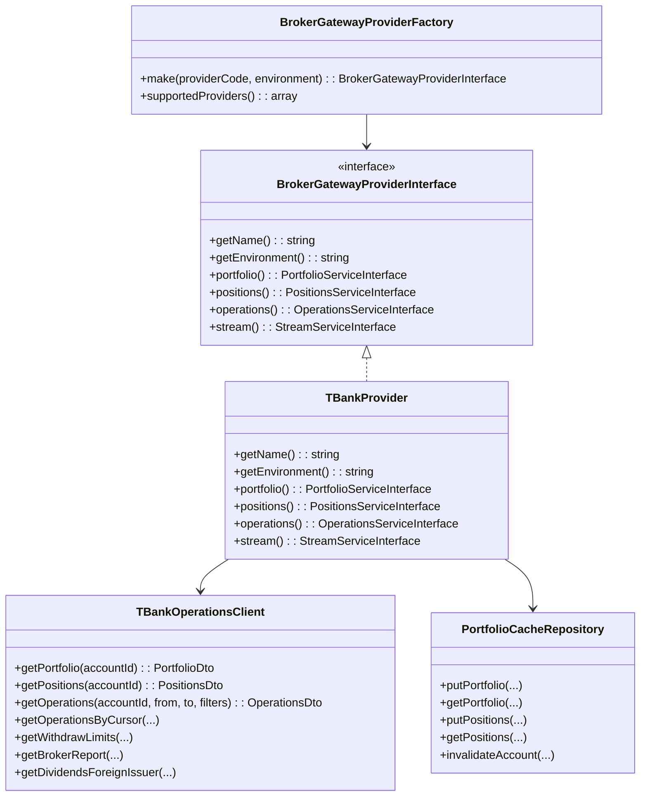
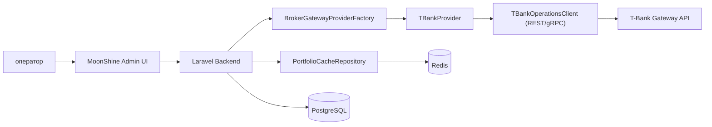

# Архитектура подключения провайдеров брокерских шлюзов (T-Bank first)

## Цель этапа

Реализовать базовый слой подключения к брокерскому шлюзу с поддержкой нескольких провайдеров, где первый провайдер — `T-Bank`.

На текущем этапе покрываем:

- подключение к `prod` и `sandbox`;
- получение базовых данных пользователя по портфелю:
  - портфель;
  - позиции;
  - операции;
- фабрику выбора провайдера;
- сервис-провайдер Laravel для регистрации зависимостей;
- краткосрочное хранение данных.

Документация API T-Bank: [T-Invest API Operations / Portfolio Stream](https://developer.tbank.ru/invest/services/operations/methods#/#portfoliostream)

## Вариант реализации (рекомендуемый)

`REST-first + подготовка к stream`:

- Реализовать базовые методы получения данных (`portfolio`, `positions`, `operations`).
- Для остальных методов заложить заглушки интерфейса и реализации.
- Выделить отдельный stream-клиент, но на старте оставить как `NotImplemented`.
- Добавить кэш с TTL для краткосрочного хранения результатов.

Преимущество: минимальная сложность на старте, сохранение расширяемости под новых провайдеров.

## Структура компонентов

- `config/broker-providers.php`
  - настройки провайдеров и окружений (`prod` / `sandbox`);
  - токены, endpoint, timeout, app-name.
- `App\Providers\BrokerGatewayServiceProvider`
  - регистрация фабрики и реализаций.
- `App\Services\BrokerGateway\Factory\BrokerGatewayProviderFactory`
  - выбор нужного провайдера по коду и окружению.
- `App\Services\BrokerGateway\Contracts\*`
  - интерфейсы provider/services.
- `App\Services\BrokerGateway\Providers\TBank\*`
  - реализация T-Bank клиента.
- `App\Services\BrokerGateway\Cache\PortfolioCacheRepository`
  - короткоживущий кэш по ключам аккаунта и провайдера.

## Перечень ключевых классов и методов

### `BrokerGatewayProviderInterface`

- `getName(): string`
- `getEnvironment(): string`
- `portfolio(): PortfolioServiceInterface`
- `positions(): PositionsServiceInterface`
- `operations(): OperationsServiceInterface`
- `stream(): StreamServiceInterface`

### `BrokerGatewayProviderFactory`

- `make(string $providerCode, string $environment): BrokerGatewayProviderInterface`
- `supportedProviders(): array`

### `TBankProvider`

- `getName(): string`
- `getEnvironment(): string`
- `portfolio(): PortfolioServiceInterface`
- `positions(): PositionsServiceInterface`
- `operations(): OperationsServiceInterface`
- `stream(): StreamServiceInterface`

### `TBankOperationsClient` (базовая реализация)

- `getPortfolio(string $accountId): PortfolioDto`
- `getPositions(string $accountId): PositionsDto`
- `getOperations(string $accountId, \DateTimeInterface $from, \DateTimeInterface $to, array $filters = []): OperationsDto`

### Методы-заглушки (на будущую реализацию)

- `getOperationsByCursor(...)`
- `getWithdrawLimits(...)`
- `getBrokerReport(...)`
- `getDividendsForeignIssuer(...)`
- `subscribePortfolio(...)`
- `subscribePositions(...)`
- `subscribeOperations(...)`

### `PortfolioCacheRepository`

- `putPortfolio(string $provider, string $environment, string $accountId, PortfolioDto $dto, int $ttlSec): void`
- `getPortfolio(string $provider, string $environment, string $accountId): ?PortfolioDto`
- `putPositions(string $provider, string $environment, string $accountId, PositionsDto $dto, int $ttlSec): void`
- `getPositions(string $provider, string $environment, string $accountId): ?PositionsDto`
- `invalidateAccount(string $provider, string $environment, string $accountId): void`

## Паттерны проектирования

- `Abstract Factory / Factory Method` — выбор провайдера (`TBank`, далее другие).
- `Strategy` — разные алгоритмы работы с API у разных брокеров.
- `Adapter` — приведение ответов внешнего API к внутренним DTO.
- `Repository` — единый интерфейс краткосрочного хранения (Redis/DB).
- `Null Object` — stream-заглушка до включения live-обновлений.
- `Template Method` (опционально) — общий pipeline запроса: auth -> call -> map -> handle errors.

## Краткосрочное хранение данных

### Вариант 1 (рекомендуемый): Redis TTL

- ключи вида:
  - `broker:{provider}:{env}:account:{id}:portfolio`
  - `broker:{provider}:{env}:account:{id}:positions`
  - `broker:{provider}:{env}:account:{id}:operations:{from}:{to}`
- TTL 30-120 секунд (подбирается по нагрузке).
- Быстрое чтение в MoonShine, снижение числа запросов к шлюзу.

### Вариант 2: Snapshot в PostgreSQL

- Таблицы с `expires_at` и периодической очисткой.
- Удобно для аудита, но выше стоимость записи.

### Вариант 3: Гибрид

- Redis как primary cache.
- PostgreSQL как fallback snapshot.

## Диаграмма классов

## C4 (Container)

Отдельный файл с C4 в PlantUML: `docs/c4-broker-provider-tbank.puml`.
