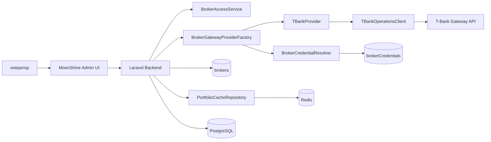

# Архитектура

## Основные документы

- [[provider-integration|Подключение провайдеров и T-Bank first]]
- [[standardization-gap-map|Матрица соответствия и стандартизация MVP-1]]
- `c4-broker-provider-tbank.puml` (PlantUML источник C4)
- [Architecture (markdown)](../architecture.md) — актуальная C4 и class-диаграммы по реализованному REST-контуру.

## Текущий фокус

- provider factory для выбора брокерского провайдера;
- резолв кода провайдера без хардкода (`BrokerProviderCodeResolver`);
- доступ к подключениям только в рамках профиля пользователя;
- получение `token/secret` только через `brokerCredentials`;
- сервис-провайдер Laravel для DI-регистрации;
- базовые API-методы (`portfolio`, `positions`, `operations`);
- split-клиенты Instruments (`AssetRestClient`, `BondRestClient`, `EtfRestClient`, `ShareRestClient`) + `InstrumentsGateway`;
- multi-account синк TBank: write-path обновляет все счета, read-path профилей остается без мутаций БД;
- заглушки для расширенных/stream методов;
- short-term cache для разгрузки внешнего API.

## Engineering Rules (обязательно)

- Все новые фичи брокерского шлюза реализуются в модульной архитектуре:
  - `laravel_app/app/Modules/BrokerGateway/*` — доменная и интеграционная логика;
  - `laravel_app/app/Providers/*` — только DI-регистрация и композиция модулей;
  - `laravel_app/app/MoonShine/*` — UI-слой без бизнес-логики интеграции.
- TDD является обязательной практикой по умолчанию:
  - сначала тест (`red`), затем минимальная реализация (`green`), затем рефакторинг (`refactor`);
  - изменения поведения без тестов считаются незавершенными.
- Для новой реализации запрещено обходить модульный слой:
  - не создавать API-клиенты напрямую в UI-слое;
  - не смешивать новую модульную реализацию с legacy-потоками без явного адаптера.
- Финализация изменений по PHP допускается только после обязательных проверок:
  - `php -l` для всех измененных PHP-файлов;
  - `mago` через make-цели проекта (минимум `make mago_ci_check`).

## C4 (кратко)

