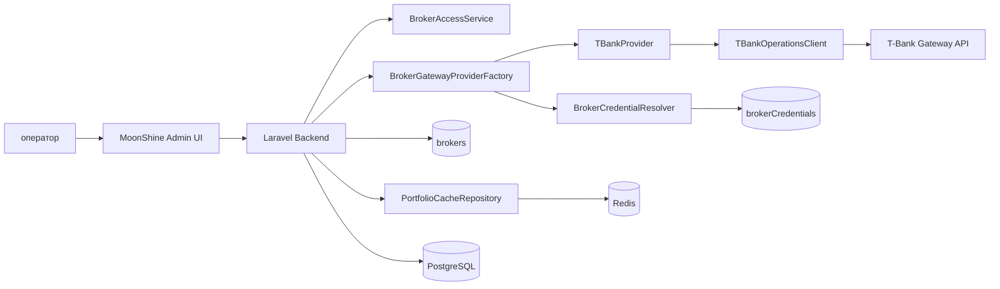

# Архитектура

## Основные документы

- [[provider-integration|Подключение провайдеров и T-Bank first]]
- `c4-broker-provider-tbank.puml` (PlantUML источник C4)

## Текущий фокус

- provider factory для выбора брокерского провайдера;
- доступ к подключениям только в рамках профиля пользователя;
- получение `token/secret` только через `brokerCredentials`;
- сервис-провайдер Laravel для DI-регистрации;
- базовые API-методы (`portfolio`, `positions`, `operations`);
- заглушки для расширенных/stream методов;
- short-term cache для разгрузки внешнего API.

## C4 (кратко)

