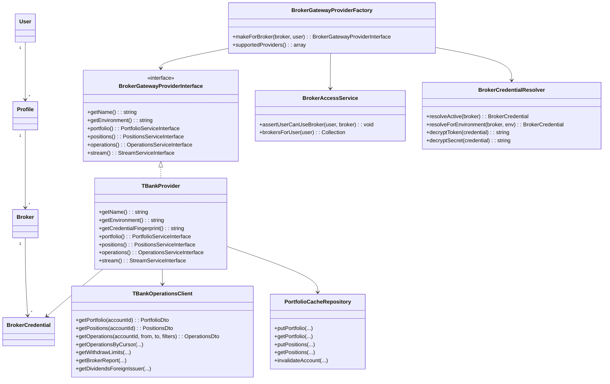
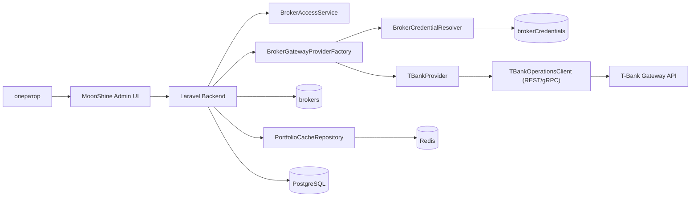

# Архитектура подключения провайдеров брокерских шлюзов (T-Bank first)

## Цель этапа

Реализовать базовый слой подключения к брокерскому шлюзу с поддержкой нескольких провайдеров, где первый провайдер — `T-Bank`.

На текущем этапе покрываем:

- подключение к `prod` и `sandbox`;
- привязку подключений к профилям пользователей в админке;
- получение базовых данных пользователя по портфелю:
  - портфель;
  - позиции;
  - операции;
- фабрику выбора провайдера;
- сервис-провайдер Laravel для регистрации зависимостей;
- безопасное чтение учетных данных из `brokerCredentials`;
- краткосрочное хранение данных.

Документация API T-Bank: [T-Invest API Operations / Portfolio Stream](https://developer.tbank.ru/invest/services/operations/methods#/#portfoliostream)

## Вариант реализации (рекомендуемый)

`REST-first + подготовка к stream`:

- Реализовать базовые методы получения данных (`portfolio`, `positions`, `operations`).
- Для остальных методов заложить заглушки интерфейса и реализации.
- Выделить отдельный stream-клиент, но на старте оставить как `NotImplemented`.
- Добавить кэш с TTL для краткосрочного хранения результатов.

Преимущество: минимальная сложность на старте, сохранение расширяемости под новых провайдеров.

## Структура компонентов

- `config/broker-systems.php` + `config/broker-systems/*.php`
  - список доступных систем и их окружений;
  - включение через `BROKER_SYSTEMS_ENABLED`.
- `config/broker-providers.php`
  - настройки провайдеров и окружений (`prod` / `sandbox`);
  - endpoint, timeout, app-name;
  - агрегирует только включенные системы;
  - токены/секреты в конфиге не храним.
- `App\Modules\BrokerGateway\Core\BrokerProviderRegistry`
  - реестр провайдеров по `code()`.
- `App\Modules\BrokerGateway\Core\BrokerProviderCodeResolver`
  - резолв кода провайдера из модели/конфига без хардкода.
- `App\Providers\BrokerGatewayServiceProvider`
  - регистрация фабрики и реализаций.
- `App\Observers\BrokerObserver`
  - после сохранения брокера синхронизирует credential через action (UI вызывает только action-контур).
- `App\Services\BrokerGateway\Factory\BrokerGatewayProviderFactory`
  - legacy-фабрика конфигурации (разрешена только как adapter-граница).
- `App\Modules\BrokerGateway\Providers\TBank\Infrastructure\Adapters\LegacyTBankProviderConfigAdapter`
  - явная adapter-граница к legacy factory.
- `App\Services\BrokerGateway\Access\BrokerAccessService`
  - проверка, что пользователь имеет доступ только к своим `brokers`.
- `App\Services\BrokerGateway\Credentials\BrokerCredentialResolver`
  - получение `token + secret` из `brokerCredentials`.
- `App\Services\BrokerGateway\Contracts\*`
  - интерфейсы provider/services.
- `App\Services\BrokerGateway\Providers\TBank\*`
  - реализация T-Bank клиента.
- `App\Services\BrokerGateway\Cache\PortfolioCacheRepository`
  - короткоживущий кэш по ключам аккаунта и провайдера.

## Перечень ключевых классов и методов

### `BrokerGatewayProviderInterface`

- `getName(): string`
- `getEnvironment(): string`
- `portfolio(): PortfolioServiceInterface`
- `positions(): PositionsServiceInterface`
- `operations(): OperationsServiceInterface`
- `stream(): StreamServiceInterface`

### `BrokerGatewayProviderFactory`

- `makeForBroker(Broker $broker, User $user): BrokerGatewayProviderInterface`
- `supportedProviders(): array`

### `BrokerAccessService`

- `assertUserCanUseBroker(User $user, Broker $broker): void`
- `brokersForUser(User $user): Collection`

### `BrokerCredentialResolver`

- `resolveActive(Broker $broker): BrokerCredential`
- `resolveForEnvironment(Broker $broker, string $environment): BrokerCredential`
- `decryptToken(BrokerCredential $credential): string`
- `decryptSecret(BrokerCredential $credential): string`

### `TBankProvider`

- `getName(): string`
- `getEnvironment(): string`
- `getCredentialFingerprint(): string`
- `portfolio(): PortfolioServiceInterface`
- `positions(): PositionsServiceInterface`
- `operations(): OperationsServiceInterface`
- `stream(): StreamServiceInterface`

### `TBankOperationsClient` (базовая реализация)

- `getPortfolio(string $accountId): PortfolioDto`
- `getPositions(string $accountId): PositionsDto`
- `getOperations(string $accountId, \DateTimeInterface $from, \DateTimeInterface $to, array $filters = []): OperationsDto`

### Методы-заглушки (на будущую реализацию)

- `getOperationsByCursor(...)`
- `getWithdrawLimits(...)`
- `getBrokerReport(...)`
- `getDividendsForeignIssuer(...)`
- `subscribePortfolio(...)`
- `subscribePositions(...)`
- `subscribeOperations(...)`

### `PortfolioCacheRepository`

- `putPortfolio(string $provider, string $environment, int $profileId, int $brokerId, string $accountId, PortfolioDto $dto, int $ttlSec): void`
- `getPortfolio(string $provider, string $environment, int $profileId, int $brokerId, string $accountId): ?PortfolioDto`
- `putPositions(string $provider, string $environment, int $profileId, int $brokerId, string $accountId, PositionsDto $dto, int $ttlSec): void`
- `getPositions(string $provider, string $environment, int $profileId, int $brokerId, string $accountId): ?PositionsDto`
- `invalidateAccount(string $provider, string $environment, int $profileId, int $brokerId, string $accountId): void`

### `AccountAggregateServiceInterface` (MVP-1)

- `getAccountSummary(Broker $broker, string $accountId): AccountSummaryDto`
- `getAllAccountsSummary(Broker $broker): AccountsAggregateDto`

Назначение:
- объединяет данные `portfolio + positions` в нормализованный view-model для UI;
- формирует агрегаты по всем счетам под токеном пользователя.

### `AccountSnapshotRepositoryInterface` (MVP-2)

- `store(AccountSnapshotDto $snapshot): void`
- `latest(string $provider, string $environment, int $profileId, int $brokerId, string $accountId): ?AccountSnapshotDto`
- `range(string $provider, string $environment, int $profileId, int $brokerId, string $accountId, \DateTimeInterface $from, \DateTimeInterface $to): array`

Назначение:
- хранение time-series срезов для dashboard динамики роста;
- источник данных для графиков по каждому счету.

## Модель доступа и хранения секретов

- `Broker` принадлежит профилю пользователя в админке.
- Пользователь видит и использует только свои подключения из раздела `brokers`.
- `token + secret` никогда не вводятся в runtime-конфиге провайдера.
- Учетные данные берутся из `brokerCredentials`, связанного с выбранным `broker`.
- Перед обращением к провайдеру выполняется `BrokerAccessService::assertUserCanUseBroker(...)`.

## Паттерны проектирования

- `Abstract Factory / Factory Method` — выбор провайдера (`TBank`, далее другие).
- `Strategy` — разные алгоритмы работы с API у разных брокеров.
- `Adapter` — приведение ответов внешнего API к внутренним DTO.
- `Repository` — единый интерфейс краткосрочного хранения (Redis/DB).
- `Null Object` — stream-заглушка до включения live-обновлений.
- `Template Method` (опционально) — общий pipeline запроса: auth -> call -> map -> handle errors.

## Краткосрочное хранение данных

### Вариант 1 (рекомендуемый): Redis TTL

- ключи вида:
  - `broker:{provider}:{env}:profile:{profileId}:broker:{brokerId}:account:{id}:portfolio`
  - `broker:{provider}:{env}:profile:{profileId}:broker:{brokerId}:account:{id}:positions`
  - `broker:{provider}:{env}:profile:{profileId}:broker:{brokerId}:account:{id}:operations:{from}:{to}`
- TTL 30-120 секунд (подбирается по нагрузке).
- Быстрое чтение в MoonShine, снижение числа запросов к шлюзу.
- Ограничение: Redis TTL хранит только текущий срез, не подходит как источник исторической динамики.

### Вариант 2: Snapshot в PostgreSQL

- Таблицы с `expires_at` и периодической очисткой.
- Удобно для аудита, но выше стоимость записи.
- Подходит как источник данных для графиков роста и исторических сравнений.

### Вариант 3: Гибрид

- Redis как primary cache.
- PostgreSQL как fallback snapshot.
- Рекомендуется для MVP-2: быстрый current-state из Redis и исторические ряды из snapshot-таблиц.

## Источник данных для dashboard динамики

### MVP-1
- Доступен только текущий срез (current-state) через `portfolio/positions` и Redis TTL.
- Графики динамики роста не включаются в scope MVP-1.

### MVP-2
- Источник графиков: `AccountSnapshotRepositoryInterface` + периодическое сохранение срезов.
- Минимальная частота snapshot для графиков: каждые 5-15 минут (настраивается).
- Pipeline: Scheduler -> SnapshotJob -> SnapshotRepository -> Dashboard query model.

## Обязательный quality gate перед финализацией

- Любые изменения в PHP-коде считаются завершенными только после синтаксической проверки `php -l` по всем измененным PHP-файлам.
- Проверка соответствия современным стандартам PHP выполняется через `mago`, запуск только через make-цели проекта.
- Минимальный обязательный запуск:

```bash
make mago_ci_check
```

## Статус MVP-1 stream

- Для MVP-1 используется безопасный fallback: `TBankStreamClient` работает как no-op и логирует пропуск.
- Команда `broker-gateway:stream` не должна ломать flow, даже пока live-stream не реализован.

## Диаграмма классов



## C4 (Container)



Отдельный файл с C4 в PlantUML: `docs/architecture/c4-broker-provider-tbank.puml`.
